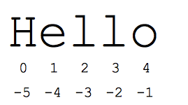

# Python
A dynamic, interpreted (bytecode-compiled) language. 

Some basic concepts:
* There are no types (there are type hints, but python doesn't use them, it's just for the IDE's and a better dev experience).
* Each line is a statement (the line break is like semicolon in C).
* Uses indentation for block level grouping (instead of having brackets `{}`).
* File extension is `.py`.

## Python code

### Modules
Every file is a module (like in JS) and you can import them with the `import something from module` expression. When a Python file is run directly, the special variable "__name__" is set to "__main__", so it's common to have something the following in your source code:
```python
if __name__ == '__main__':
    main()
```

### User defined functions
To create a function use the `def` keyword followed by the name, then the parameters in between parenthesis and end with a colon (`:`).
```python
def greet(name):
	print('Hello there', name)
```

#### Lambda Functions
Like arrow functions in JS. Small one time use anonymous functions:
```python
lambda param1, param2: param1 + param2
```

### Command Line
You run python files with the `python3` command. If you need to pass parameters then use the `sys` module's `argv` property with `argv[0]` being the program itself, `sys.argv[1]` the first argument, and so on.
```python
# hello.py
import sys

def main():
    print('Hello there', sys.argv[1]) # sys.argv[0] = 'hello.py'
```
And you run this with: `python3 hello.py Bob`.

### Variables
Python is case sensitive, so `a` and `A` are two different variables.

You don't need a type so just doing `x = 1` will create the `x` variable and set it's value to `1`. You can then reassign a value to it or just delete it (free up the memory) with `del x`.

You can declare variables individually
```python
x = 1
y = 2.5
name = 'John'
is_true = True
```
Or use a destructuring like syntax (as in JS) and assign all values in one line, the following code is equivalent to the one above:
```python
x, y, name, is_true = (1, 2.5, 'John', True)
```
> [!IMPORTANT]
> Python has some built-in functions, like len(data) which returns the length of the data structure that you passed as parameter. A common error is to use the `len` word as a variable and store something in there, don't. There are reserved words like `while` and `if` that throw errors, but built-in functions/variables don't act like that, so you would just be overwriting whatever values were there.


### Code checking
Python does very little checking at compile time, deferring almost all type, name, etc. checks on each line until that line runs (runtime).
```python
def main():
    if name == 'Guido':
        print(greeeeeeet(name) + '!!!') # Pay special attention to this line!!!
    else:
        print(greet(name))
```
You'll see that the function `greet` defined in [this section](#user-defined-functions) is misspelled as `greeeeeeet`. However, the above code will compile and run perfectly until `name` is `'Guido'` and it actually goes in the `if` statement where it will give an error.


## Strings
* Python has a built in class named `str`.
* Python strings are "immutable" (can't be changed after created).
* Strings be in single or double quotation marks.
* Usual concatenation methods like using the `+` operator works, but python also allows things like `'-'*10` which will display the `-` character ten times.
* You can find some string methods on [python docs](https://docs.python.org/3/library/stdtypes.html#string-methods).
* Unlike in other languages, the `==` is optimized to compare strings in Python.

### Formatting

#### .format() method
You can pass arguments as needed to the `.format()` function and every value in between brackets (`{}`) will be replaced:
```python
print('Hello {name}, are you really {age} years ol? Quite {just_a_variable}'.format(name='John', age=105, just_a_variable='old'))
# Or if the values are already in variables
print('Hello {name}, are you really {age} years ol? Quite {just_a_variable}'.format(name=name, age=age, just_a_variable=some_variable))
```

#### f strings - since python 3.6
You can do the exact same thing as with the `.format()` but without having to pass the values separately if you prepend an `f` to the string:
```python
print(f'Hello {name}, are you really {age} years ol? Quite {just_a_variable}')

# with objects
car = {'tires':4, 'doors':2}
print(f'car = {car}') # car = {'tires': 4, 'doors': 2}
```
#### % operator
The % operator takes a printf-type (from `C`) format string on the left, and the matching values in a tuple on the right.
```python
text = "%d little pigs come out, or I'll %s, and I'll %s, and I'll blow your %s down." % (3, 'huff', 'puff', 'house')
```

### Slices
The *slice* syntax is a way to refer to sub-parts of sequences. The slice `s[start:end]` is the elements beginning at start and extending up to but not including end.

You can access a string using the standard `[]` syntax with indexes (zero-based). Also, python uses negative numbers to give easy access to the chars at the end of the string: s[-1] is the last char.



**Positive indexes:**

* `s[1:4]` is `'ell'`: chars starting at index 1 and extending up to but not including index 4
* `s[1:]` is `'ello'`: omitting either index defaults to the start or end of the string
* `s[:]` is `'Hello'`: omitting both always gives us a copy of the whole thing (this is the pythonic way to copy a sequence)
* `s[1:100]` is `'ello'`: an index that is too big is truncated down to the string length

**Negative indexes:**

* `s[-1]` is `'o'`: last char (1st from the end)
* `s[-4]` is `'e'`: 4th from the end
* `s[:-3]` is `'He'`: going up to but not including the last 3 chars.
* `s[-3:]` is `'llo'`: starting with the 3rd char from the end and extending to the end of the string.

### Byte vs Unicode
Regular strings are unicode, but Python also supports strings composed of plain bytes (denoted by the prefix `b` in front of a string literal) like:
`byte_string = b'A byte string'`.
```python
ustring = 'A unicode \u018e string \xf1'
b = ustring.encode('utf-8')
print(b) # outputs -> b'A unicode \xc6\x8e string \xc3\xb1' 				
t = b.decode('utf-8')
print(t == ustring) # True
```


## Data Structures

### Slices
Slices are objects usually containing a part of a sequence that's created with the `[]` notation. Works for any sequence just like in strings.

E.g. for a list `l = [1,2,3,4,5]`:
* `l[:]` returns `[1,2,3,4,5]`
* `l[1:]` returns `[2,3,4,5]`
* `l[2:4]` returns `[3,4]`
* `l[-1]` returns `5`

### Lists
A list is a sequence:
* Zero-based indexed
* Ordered (items are in the list in the order they are inserted, doesn't mean sorted)
* Changeable or Mutable
* It allows duplicate items

From python docs:
>  it is more akin to an array in other languages than to a linked list since access to elements is O(1).

You can create a list like:
* `[]`: `l = [1,2,3,4,5]`
* `list()`: `l2 = list((1,2,3,4,5))`
* List comprehension: `l3 = [n * n for n in some_iterable]`

Python docs on list comprehension:
> A compact way to process all or part of the elements in a sequence and return a list with the results.

Assignment with an `=` on lists does not make a copy. Instead, assignment makes the two variables point to the one list in memory.

The `+` works to append two lists, so `[1, 2] + [3, 4]` yields `[1, 2, 3, 4]`. This is a new list, regardless whether the second expression is empty or not so:
```python
>>> l = [1,4,8,2,9]
>>> l2 = l
>>> l.append(1)
>>> l
[1,4,8,2,9,1]
>>> l2
[1,4,8,2,9,1]
>>> l3 = l2 + []
>>> l2.append(99)
>>> l
[1,4,8,2,9,1,99]
>>> l2
[1,4,8,2,9,1,99]
>>> l3
[1,4,8,2,9,1]
```

### Tuples
A tuple is a sequence:
* Zero-based indexed
* Ordered (items are in the tuple in the order they are inserted, doesn't mean sorted)
* Immutable
* It allows duplicate items

You can create a tuple like:
* Separating items with comma: `t = 1,2,3,4,5`
* `()`: `t2 = (1,2,3,4,5)`
* `tuple()`: `t3 = tuple((1,2,3,4,5))`

> [!NOTE]
> If you want to make a one item tuple the use a trailing coma, otherwise python will just take it as an expression in between parenthesis:
> `t = (1,)`
> If there is syntactic ambiguity, then the parenthesis cannot be omitted. E.g. a function `hi(names: tuple[str])` calling `hi('John','Mary','Some Name')` is interpreted as multiple parameters instead of a tuple, in which case parenthesis should be used.

### Sets
A set is a collection:
* There is no index
* Unordered (items are not in the set in the order they are inserted)
* Mutable
* It doesn't allows duplicate items

You can create a set like:
* `{}`: `s = {1,2,3,4}`
* `set()`: `s2 = set((1,2,3,4,5))`
* Set comprehension: `{c for c in 'abracadabra' if c not in 'abc'}`

> [!NOTE]
> For empty sets `{}` doesn't work (it creates an empty [dict](#dicts)) so use `set()`.

### Dicts
A dictionary is a collection with `key:value` pairs:
* Indexed by keys (so strings, not integers)
* Unordered (items are not in the dict in the order they are inserted)
* Mutable
* It doesn't allows duplicate items

You can create a dict like:
* `{}`: `ages = {'john': 45, 'doe': 20}`

You access an item with the `[]` syntax: `ages['john]`. If you want the keys/values only, use the `.keys()` or `.items()` respectively (returns a list).

## The range() function
The `range(n)` function yields the numbers `0, 1, ... n-1`, and `range(a, b)` returns `a, a+1, ... b-1` up to but not including the last number.

This sequence returned is not a list, but of type `range`.

## Operators
Only python specific ones will be here, check [the docs](https://docs.python.org/3/reference/lexical_analysis.html#operators) to see all operators.

### Logical operators:
* `and`: like `&&` in C
* `or`: like `||` in C
* `not`: like `~` in C

### Membership operators:
* `in`: checks whether a value is in a collection. E.g. `1 in [1,2,3,4]` which returns `True`

### Identity operators
* `is`: checks whether the identity is the same, when the variables on either side points at the exact same object returns true. (so pointer comparison more than value comparison).

Check this example:
```python
>>> string1 = 'hello'
>>> string2 = 'hello'
>>> id(string1)
139699879691376
>>> id(string2)
139699879691376
>>> string1 == string2
True
>>> string1 is string2
True
>>> string1 = string1.replace('h', 'm')
>>> string1 = string1.replace('m', 'h')
>>> string1
'hello'
>>> string2
'hello'
>>> string1 == string2
True
>>> string1 is string2
False
>>> id(string1)
139699879691568
>>> id(string2)
139699879691376
```