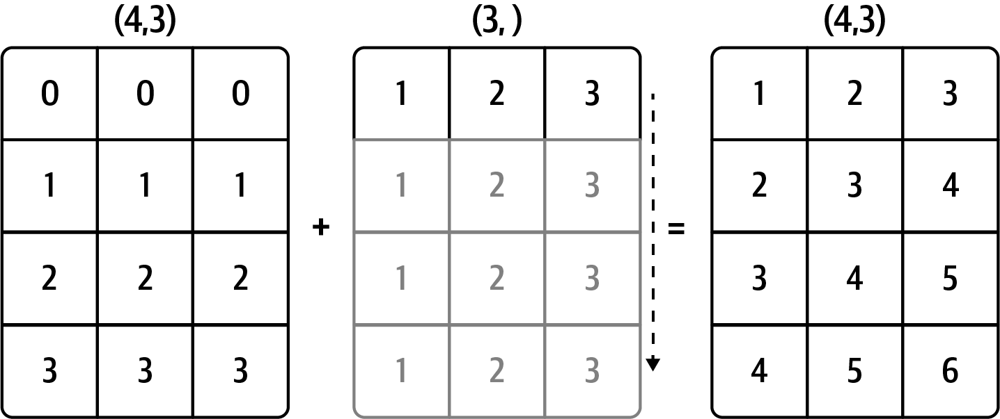
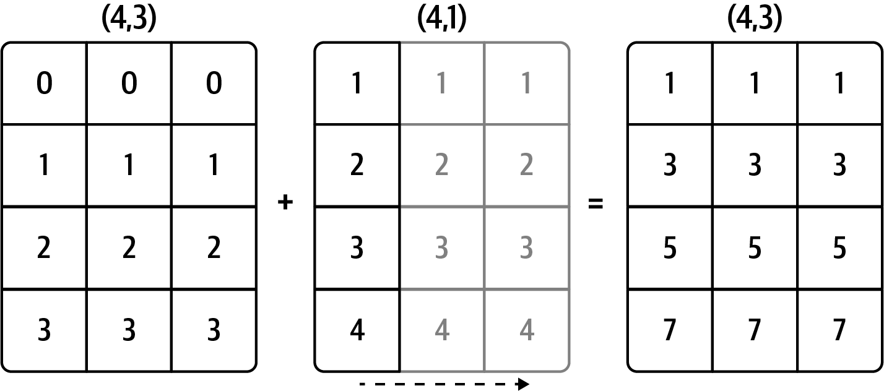
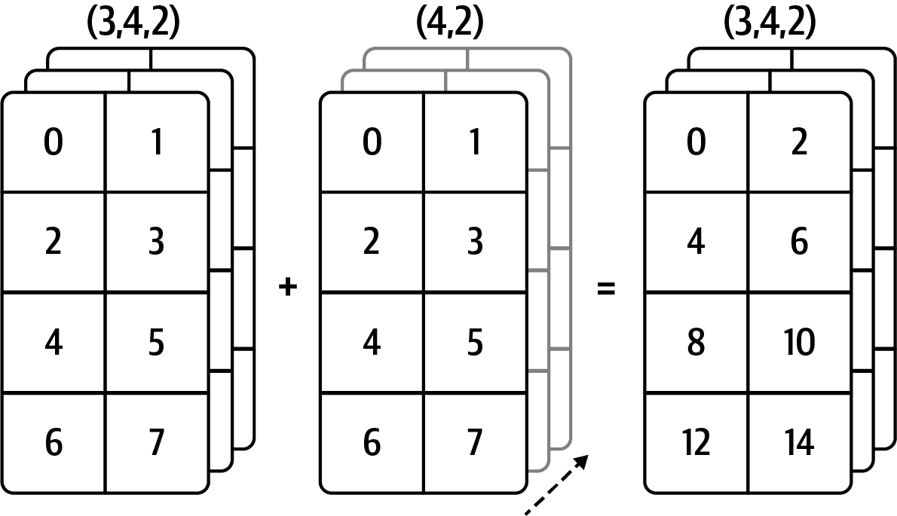

- [NumPy](#numpy)
	- [Arrays](#arrays)
		- [Arithmetic Operations](#arithmetic-operations)
		- [Some methods](#some-methods)
		- [Selection](#selection)
			- [Basic Indexing](#basic-indexing)
			- [Fancy Indexing](#fancy-indexing)
	- [Math functions](#math-functions)
	- [Randomness](#randomness)
	- [Universal Functions](#universal-functions)
	- [Sorting](#sorting)
	- [Unique And Other Set Logic](#unique-and-other-set-logic)
	- [Broadcasting](#broadcasting)

# NumPy

Short for Numerical Python, a library for Python.

I'll be referencing numpy with `np`.

## Arrays
NumPy has their own array called `ndarray`, which is not a class (so you can't check for instances of that with `isinstance(x,np.array)`, it gives a `TypeError`)

* Create an array with `arr = np.array(<data>)`. You could specify the data type with an additional param called `dtype`, e.g. default for integers is `int32` (check all data types [here](https://wesmckinney.com/book/numpy-basics#tbl-table_array_dtypes)).
* Create empty array with `np.empty((2,2))` with the tuple passed being the dimensions (doesn't have to be 2d). This doesn't even initialized the values so you'll get garbage. You can use `np.zeros((2,2))` to do the same but initialize all values to 0, or `np.ones()` to initialize all values with ones.
* Create array following a sequence with `np.arange(n[, m, steps])` with `n` being the data that goes from 0 to n-1 or from `n` to `m` if `m` is specified. `steps` is just the amount `n` is increased by in each iteration until it gets to `m`.
* Create an array with `n` items with `np.linspace(n, m, items)`. This creates an array with `items` items in between `n` and `m`.
* Check dimensions with `arr.shape # (2,2)` (gives columns size first).
* Check total amount of data with `arr.size # 4 (following dimensions example)`.

### Arithmetic Operations
Any arithmetic operations between equal-size arrays apply the operation element-wise:
```python
arr = np.array([[1., 2., 3.], [4., 5., 6.]])

arr * arr
# array([[ 1.,  4.,  9.],
#        [16., 25., 36.]])

arr - arr
# array([[0., 0., 0.],
#        [0., 0., 0.]])
```

Arithmetic operations with scalars propagate the scalar argument to each element in the array:
```python
1 / arr
# array([[1.    , 0.5   , 0.3333],
#        [0.25  , 0.2   , 0.1667]])
```

Comparisons between arrays of the same size yield Boolean arrays:
```python
arr2 = np.array([[0., 4., 1.], [7., 2., 12.]])

arr2 > arr
# array([[False,  True, False],
#        [ True, False,  True]])
```

### Some methods
From all `ndarrays`, you have:
* `arr.min()` for minimum
* `arr.max()` for maximum
* `arr.mean()` for the median
* `arr.std()` for the standard deviation
* `arr.sum()` adds up all values in the array

and such

When working with 2d arrays (matrices) things like min function or max will work across the columns or files depending on the axis specified:
```python
import numpy as np

arr = np.array([
	[6,  8,  11,  8]
	[13, 14,  0,  0],
	[5,  10,  1,  2],
	[18, 16, 14,  2],
])

arr.min(axis = 0) # columns, takes the min of every column
# [5, 8, 0, 0]

arr.max(axis = 1) # rows, takes the min of every row
# [11, 14, 10, 18]
```

### Selection

The slices and indexing that applies to python sequences and strings is used here, so use `[]`.

#### Basic Indexing

For 2d arrays you use the basic `[]` syntax. You can use `arr[0][2]` or `arr[0,2]` to select the third column in the first row:
```python
arr2d = np.array([[1, 2, 3], [4, 5, 6], [7, 8, 9]])

arr2d[0][2]
# 3

arr2d[0, 2]
# 3
```

In multidimensional arrays, if you omit later indices, the returned object will be a lower dimensional ndarray consisting of all the data along the higher dimensions.
```python
arr2d = np.array([[1, 2, 3], [4, 5, 6], [7, 8, 9]])

arr2d[0]
# [1, 2, 3]
```

You can select a set of values of a `ndarray` with the booleans arrays seen in the [arithmetic operations section](#arithmetic-operations) of the arrays:
```python
arr>12 # returns the boolean matrix
# [
# 	[False,  False,  False,  False],
# 	[True,    True,  False,  False],
# 	[False,  False,  False,  False],
# 	[True,    True,  True,   False]
# ]

arr[arr>12] # You do lose the shape
# [13, 14, 18, 16, 14]
```

> [!IMPORTANT]
> The Python keywords `and` and `or` do not work with Boolean arrays. Use `&` (and) and `|` (or) instead.

#### Fancy Indexing

To select a subset of the rows in a particular order, you can simply pass a list or ndarray of integers specifying the desired order:
```python
arr = np.array([[0., 0., 0., 0.],
       [1., 1., 1., 1.],
       [2., 2., 2., 2.],
       [3., 3., 3., 3.],
       [4., 4., 4., 4.],
       [5., 5., 5., 5.],
       [6., 6., 6., 6.],
       [7., 7., 7., 7.]])

arr[[4, 3, 0, 6]]
# array([[4., 4., 4., 4.],
#        [3., 3., 3., 3.],
#        [0., 0., 0., 0.],
#        [6., 6., 6., 6.]])

# Using negative indices selects rows from the end:
arr[[-3, -5, -7]]
# array([[5., 5., 5., 5.],
#        [3., 3., 3., 3.],
#        [1., 1., 1., 1.]])

```

Passing multiple index arrays selects a one-dimensional array of elements corresponding to each tuple of indices:
```python
arr = np.array([
	[ 0,  1,  2,  3],
    [ 4,  5,  6,  7],
    [ 8,  9, 10, 11],
    [12, 13, 14, 15],
    [16, 17, 18, 19],
    [20, 21, 22, 23],
    [24, 25, 26, 27],
    [28, 29, 30, 31]]
)

arr[[1, 5, 7, 2], [0, 3, 1, 2]] # so, tuple (1,0) -> arr[1,0] -> 4
# array([ 4, 23, 29, 10])
```

## Math functions

You have the typical trigonometric functions:
* `np.sin()`
* `np.cos()`
...

There's also a submodule for linear algebra which is `linalg` and you can use it like this:
```python
import numpy as np

A = np.array([[6, 1, 1],
              [4, -2, 5],
              [2, 8, 7]])

print("\nMatrix A raised to power 3:\n", np.linalg.matrix_power(A, 3))
# Matrix A raised to power 3:
#  [[336 162 228]
#  [406 162 469]
#  [698 702 905]]
```

[List of common linalg's module functions](https://wesmckinney.com/book/numpy-basics#tbl-table_numpy_linalg) from McKinney book. 

## Randomness
A way to produce random numbers is using `np.random.default_rng(seed)` which you can pass a `seed` to and returns an object to which you can ask random numbers (`seed` is important for reproducibility).
```python
rg = np.random.default_rng(17)

print(rg.random(1)) # 1 is the amount of random numbers to get
# array([0.29924217]) - i made this up
```

If you only want integers the use `rg.integers(n [, m][, size])` with `n` being the data that goes from 0 to n-1 or from `n` to `m` if `m` is specified. `size` is the amount of items you'll get, always in between 0 and n-1 or `n` and `m`.

You can have a normal data as well with `rg.normal(media, std_deviation, n)` with `n` being the amount of data wanted (also follows the `seed` passed when creating rg).

[Here is a list](https://wesmckinney.com/book/numpy-basics#tbl-table_numpy_random) of all random generators, including `rg.normal` and `rg.integers`.

## Universal Functions

A universal function, or ufunc, is a function that performs element-wise operations on data in ndarrays.

There are unary ufuncs:
```python
arr = np.array([0, 1, 2, 3, 4, 5, 6, 7, 8, 9])

np.sqrt(arr)
# array([0., 1., 1.4142, 1.7321, 2., 2.2361, 2.4495, 2.6458, 2.8284, 3.])
```

And ufuncs that take two arrays (binary ufuncs):
```python
x = rng.standard_normal(8)
y = rng.standard_normal(8)

np.maximum(x, y)
# array([-0.467 ,  0.6489,  0.7888, -1.2567,  2.3474,  1.399 ,  1.3223,
#        0.9022])
```

[List of some unary ufuncs](https://wesmckinney.com/book/numpy-basics#tbl-table_unary_ufuncs) from McKinney book.

[List of some binary ufuncs](https://wesmckinney.com/book/numpy-basics#tbl-table_binary_ufuncs) from McKinney book.

## Sorting
The python `.sort()` method which sorts in place can be used, but numpy includes a `np.sort()` that returns a sorted copy of an array. With this method you can also specify an axis to sort by:
```python
arr = np.array([[ 0.936 ,  1.2385,  1.2728],
       [ 0.4059, -0.0503,  0.2893],
       [ 0.1793,  1.3975,  0.292 ],
       [ 0.6384, -0.0279,  1.3711],
       [-2.0528,  0.3805,  0.7554]])

# arr.sort(axis=0)    # in place
np.sort(arr, axis=0)  # returns another array
# array([[-2.0528, -0.0503,  0.2893],
#        [ 0.1793, -0.0279,  0.292 ],
#        [ 0.4059,  0.3805,  0.7554],
#        [ 0.6384,  1.2385,  1.2728],
#        [ 0.936 ,  1.3975,  1.3711]])

# arr.sort(axis=1)    # in place
np.sort(arr, axis=1)  # returns another array
# array([[-2.0528, -0.0503,  0.2893],
#        [-0.0279,  0.1793,  0.292 ],
#        [ 0.3805,  0.4059,  0.7554],
#        [ 0.6384,  1.2385,  1.2728],
#        [ 0.936 ,  1.3711,  1.3975]])
```

## Unique And Other Set Logic

You can get an array of unique values with `np.unique(array)`, which not only returns unique values it sorts them as well.

Another function, numpy.in1d, tests membership of the values in one array in another, returning a Boolean array:
```python
values = np.array([6, 0, 0, 3, 2, 5, 6])

np.in1d(values, [2, 3, 6])
# array([ True, False, False,  True,  True, False,  True])
```

[List of set operations](https://wesmckinney.com/book/numpy-basics#tbl-table_setops) from McKinney book.

## Broadcasting

*Broadcasting* governs how operations work between arrays of different shapes. Two arrays are compatible for broadcasting if for each trailing dimension (i.e., starting from the end) the axis lengths match or if either of the lengths is 1. Broadcasting is then performed over the missing or length 1 dimensions. E.g:
```python
arr = np.arange(5)
# array([0, 1, 2, 3, 4])

arr * 4
# array([0, 4, 8, 12, 16])
```

This is a simple example with 1 length arrays, consider a matrix now. They are compatible if the axis length are the same or one of them is 1:



In this case, since the 2nd array (3,) has length 3, it is compatible for broadcasting across axis 0 because the trailing dimension in `arr` is 3 (4,3) and therefore matches. But what if we want to add across axis 1? To add over axis 1 (i.e., add the values in `arr` mean from each row), the smaller array must have the shape (4, 1):
```python
# array = array([[0, 0, 0],
#        	[1, 1, 1],
#        	[2, 2, 2],
#        	[3, 3, 3]])

# arr = array([1, 2, 3, 4])
arr.shape
(4,)

arr.reshape((4,1))
# array([[1],
#        [2],
#        [3],
#        [4]])

array + arr.reshape((4,1))
# array([[1, 1, 1],
#        [3, 3, 3],
#        [5, 5, 5],
#        [7, 7, 7]])
```

For a more graphic example check this:




Here is an example for a 3d array addition with a 2d array:

